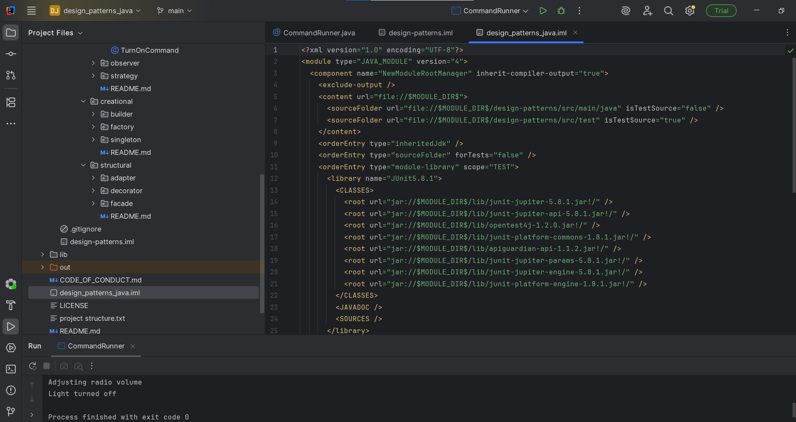
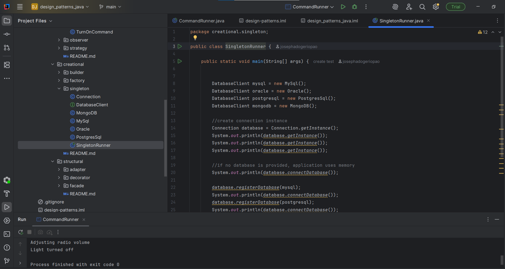
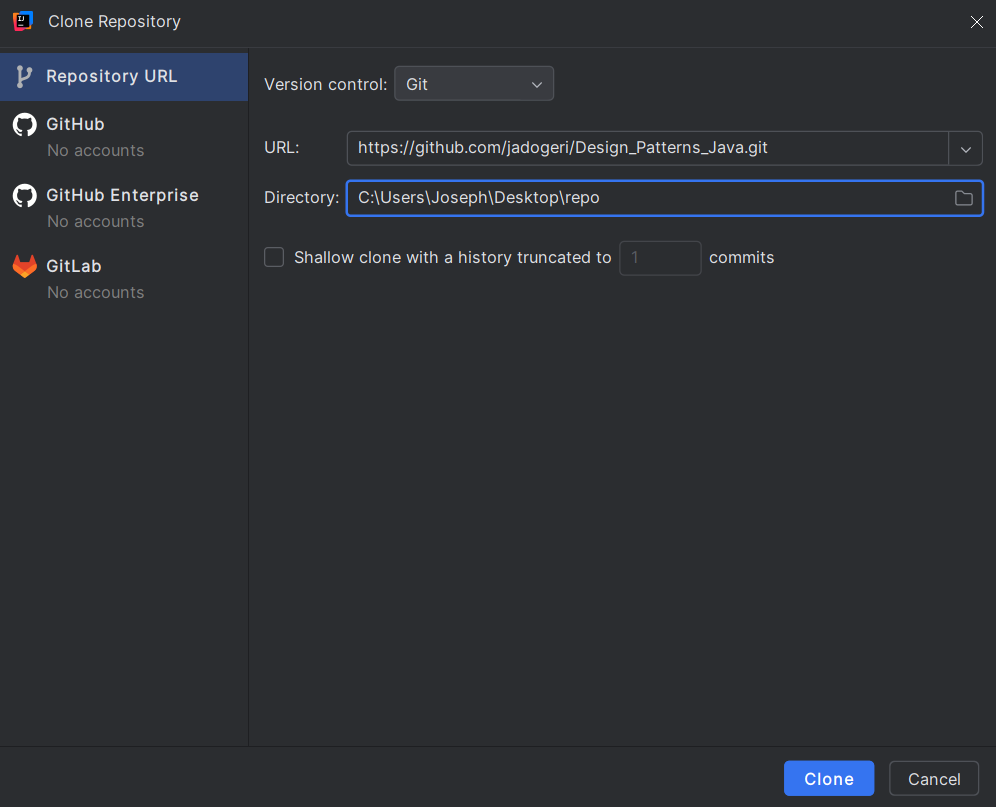
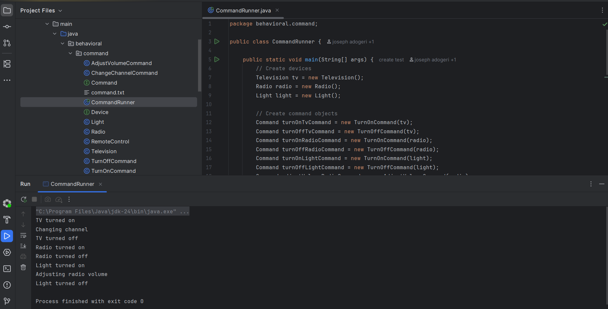

# **Design Patterns JAVA**

**Version:** 1.0.0

**Date:** September 28, 2025

---

## Description

This repository is for learning and implementing software design patterns concepts.

## Authors

[@jadogeri](https://www.github.com/jadogeri)

## Repository

[https://github.com/jadogeri/Design_Patterns_Java.git](https://github.com/jadogeri/Design_Patterns_Java.git)


## Screenshots

|  |  |
| -------------------------------------------- | -------------------------------------------- |

## Table of Contents

<ul>
    <li><a href="#1-introduction">1. Introduction</a>
        <ul>
            <li><a href="#11-purpose">1.1 Purpose</a> </li>
            <li><a href="#12-scope">1.2 Scope</a> </li>
            <li><a href="#13-intended-audience">1.3 Intended Audience</a> </li>
        </ul>
    </li>
</ul>
    <ul>
      <li><a href="#2-technology-stack">2. Technology Stack</a>
      </li>
    </ul>
    <ul>
      <li><a href="#3-data-design">3. Project Structure</a>
        <ul>
          <li><a href="#31-data-entities-and-relationships">3.1 Entities and Relationships</a> </li>
        </ul>
      </li>
    </ul> 
    <ul>
      <li><a href="#4-installation">4. Installation</a>
      </li>
    </ul> 
    <ul>
        <li><a href="#5-usage">5. Usage</a>
        <ul>
            <li><a href="#51-run-application">5.1 Run Application</a> </li>
        </ul>
        </li>
    </ul> 
    <ul>  
        <li><a href="#8-license">8. License</a>
        </li>
    </ul> 
    <ul> 
        <li><a href="#9-references">9. References</a>
        </li>
    <ul>

## **1. Introduction**

### **1.1 Purpose**

The purpose of this project is to learn and apply software design patterns principles in a small scale.

### **1.2 Scope**

This project will allow users to :

- Utilize code snippet in larger project.
- Implement SOLID principles while writing code.

### **1.3 Intended Audience**

- Junior or Senior backend developers.
- beginners learning Spring Boot (Java).

---

## **2. Technology Stack**

- **Programming Languages**: Java
- **IDE**: IntelliJ and Visual Studio Code (VSCode)
- **Plugins**: Early AI
- **Version Control**: Git and GitHub
- **Code Analsis**: SonarQube
- **Build**: Maven


## **3. Project Structure**

A Java project can be structured to demonstrate various design pattern implementations. This involves organizing code into packages and classes that exemplify the principles and structures of different patterns. 
Project Structure: 
A common approach is to create a top-level package for the project, such as com.example.designpatterns. Within this, sub-packages can be created for each category of design patterns (Creational, Structural, Behavioral) and further sub-packages for individual patterns. 

```tree
design-patterns
└── src/main/java
    ├── creational
    │   ├── singleton
    │   │   ├── Connection.java
    │   │   ├── DatabaseClient.java
    │   │   ├── MySql.java
    │   │   ├── Oracle.java
    │   │   ├── MongoDB.java
    │   │   ├── PostgresSql.java
    │   │   └── SingletonRunner.java
    │   ├── factory
    │   │   ├── Game.java
    │   │   ├── GameFactory.java
    │   │   ├── PlayStation.java
    │   │   ├── Nintendo.java
    │   │   ├── Xbox.java
    │   │   ├── PlayStationFactory.java
    │   │   ├── NintendoFactory.java
    │   │   ├── XboxFactory.java
    │   │   └── FactoryRunner.java
    │   └── builder
    │       ├── Pizza.java
    │       ├── Product.java
    │       └── BuilderRunner.java
    ├── structural
    │   ├── adapter
    │   │   ├── LegacyPrintable.java
    │   │   ├── ModernPrintable.java
    │   │   ├── LegacyPrinter.java
    │   │   ├── PrinterAdapter.java
    │   │   └── AdapterRunner.java
    │   ├── decorator
    │   │   ├── Burger.java
    │   │   ├── RegularBurger.java
    │   │   ├── BurgerDecorator.java
    │   │   ├── MayoDecorator.java
    │   │   ├── OnionDecorator.java
    │   │   ├── PickleDecorator.java
    │   │   ├── CheeseDecorator.java
    │   │   └── DecoratorRunner.java
    │   └── facade
    │       ├── ApplePay.java
    │       ├── VisaCard.java
    │       ├── DHL.java
    │       ├── MonarchInventoryService.java
    │       ├── PaymentService.java
    │       ├── InventoryService.java
    │       ├── ShippingService.java
    │       ├── USPS.java
    │       ├── OrderFacade.java
    │       └── FacadeRunner.java
    └── behavioral
        ├── strategy
        │   ├── Card.java
        │   ├── CreditCardStrategy.java
        │   ├── DebitCardStrategy.java
        │   ├── PaypalStrategy.java
        │   ├── PaymentStrategy.java
        │   ├── InsufficientFundsException.java
        │   ├── ShoppingCart.java
        │   └── StrategyRunner.java
        ├── observer
        │   ├── Subject.java
        │   ├── Observer.java
        │   ├── ChatRoom.java
        │   ├── Message.java
        │   ├── User.java
        │   └── ObserverRunner.java
        └── command
            ├── Command.java
            ├── Device.java
            ├── Radio.java
            ├── Light.java
            ├── Television.java
            ├── Light.java
            ├── TurnOnCommand.java
            ├── TurnOffCommand.java
            ├── AdjustvolumeCommand.java
            ├── ChangeChannelCommand.java
            ├── RemoteControl.java
            └── CommandRunner.java

```
Implementation Details: 

• Creational Patterns: 
	• Singleton: Implement a class with a private constructor, a static instance, and a static getInstance() method to ensure only one instance exists. 
	• Factory Method: Define an interface or abstract class for products and concrete product implementations. Create a factory interface/abstract class and concrete factories to create product objects. 
	• Builder: Create a separate builder class to construct complex objects step-by-step, allowing for flexible object creation. 

• Structural Patterns: 
	• Adapter: Create an adapter class that allows incompatible interfaces to work together by converting the interface of one class into another. 
	• Decorator: Use concrete decorator classes to add new responsibilities to objects dynamically without modifying their core structure. 

• Behavioral Patterns: 
	• Strategy: Define an interface for a family of algorithms, encapsulate each algorithm in a separate class, and allow clients to choose the desired algorithm at runtime. 
	• Observer: Implement a subject (publisher) and observer (subscriber) interface. The subject maintains a list of observers and notifies them of state changes. 
	• Command: Create Command objects (e.g., TurnOnLightCommand) to encapsulate requests, executed by a RemoteControl.


---

## **4. Installation**

* [Download and install IntelliJ Community Edition](https://www.jetbrains.com/idea/download/?section=windows)
* [Download and install Java](https://www.oracle.com/java/technologies/downloads/)
* [Download and install Maven](https://maven.apache.org/download.cgi)

---

## **5. Usage**

**Prerequisites** :installation of IntelliJ IDE, Docker and Maven.

### **5.1 Run Application**

0 open intelliJ IDE.

1 Select option `CLONE REPOSITORY` .

2 Copy and paste url `https://github.com/jadogeri/Spring-Boot-Demo-Factory-API.git` and choose location to save project then press clone.

 (Note!! choose empty folder : I created folder factoryAPI)




3 Change view to Project.

4 Navigate to factory --> `src` --> `main` -- `java`.

5 Inspect file `FactoryApplication.java`.

6 Press play button to start application.




## **6. API Testing**

**Prerequisites** : Ensure container or local application is running.

**Note** : Use [http://localhost:8080/swagger-ui/index.html](http://localhost:8080/swagger-ui/index.html) docs for testing endpoints.


---


[LICENSE](/LICENSE)

---

## **9. References**

* JUnit5 : [JUnit 5 User Guide](https://docs.junit.org/current/user-guide/).
* Symflower : [Symflower feature overview](https://www.youtube.com/watch?v=17KKqlLNcTc).
* TestContainers : [Awesome Readme Templates](https://awesomeopensource.com/project/elangosundar/awesome-README-templates)
* Swagger :  [Swagger API Documentation for Spring Boot 3](https://www.baeldung.com/spring-rest-openapi-documentation)
* Medium : [Handling exceptions and error responses ](https://leejjon.medium.com/handling-exceptions-and-error-responses-in-java-rest-services-afda273c9d2f)
* TutorialsPoint : [JUnit unit testing tool](https://www.tutorialspoint.com/junit/junit_basic_usage.htm)
